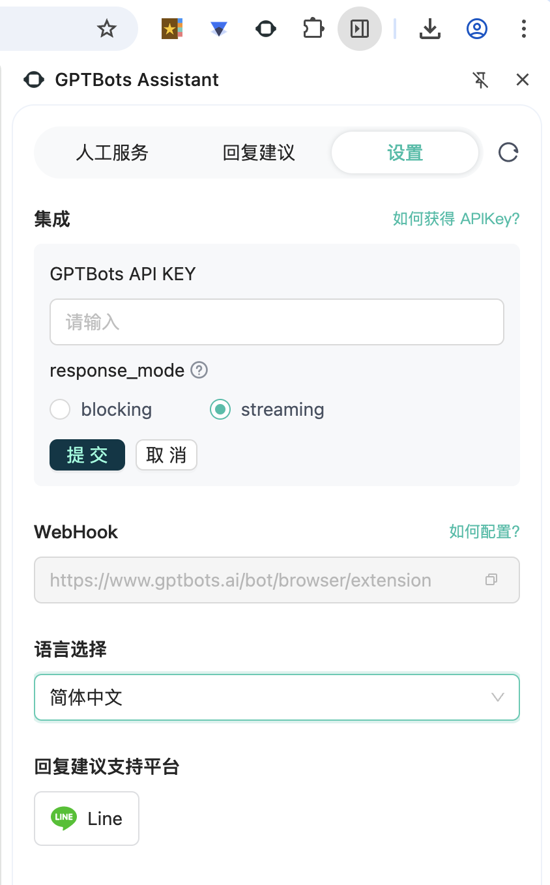

# gptbots-chrome-extension
[English](./README.md) | 中文

一个基于浏览器插件技术的AI客服助手。
基于LINE WEB后台可提供自动回复用户消息，接收人工服务请求提醒等功能。后续将陆续支持Telegram、WhatsApp等更多平台。



## Setup
Rsbuild project

Install the dependencies:

```bash
pnpm install
```

## Get started

Start the dev server:

```bash
pnpm dev
```

Build the app for production:

```bash
pnpm build
```

Preview the production build locally:

```bash
pnpm preview
```

## 开发
1. 需要先在浏览器先把插件导入到浏览器中，直接导这个chrome文件夹
2. 需要先在插件的设置里先设置集成的GPTBots API KEY，对应环境下的集成api（可以直接使用stg或者生产的集成API）
3. 其次直接构建项目 pnpm run build:prod
4. 打开插件，即可以在对应的官方账号上查看对应页面

## 插件打包
执行构建命令后，

在`bash`环境下，终端执行`npm run zip:chrome`创建`zip`压缩文件，生成如：`gptbots-assistant-06171839.zip`，给到测试
> 或者手动把`chrome`文件夹压缩成`zip`

- 开发打包
```
npm run build:dev
```

- 生产环境打包
```
npm run build:prod
```

## 插件存储
使用`chrome.storage.local`存储数据


## content-script
- 切换回复用户
> chrome/content-scripts/line/user-reply.js
```js
/**
 * 切换聊天
 * @param {string} name
 */
function handleSwitchChat(name) {
  const userList = document.querySelectorAll('.list-group-item-chat>a');
  if (userList) {
    const item = Array.from(userList).find((i) => {
      const el = i.querySelector('h6.text-truncate-box');
      return el && el.innerText === name;
    });
    if (item) {
      item.click();
      setTimeout(() => handleInit(), 100);
    }
  }
}
```

- 获取聊天回复的内容
> chrome/content-scripts/line/user-reply.js
```js
/** 处理用户回复 */
function handleUserReply() {
  const messageEls = Array.from(document.querySelectorAll('.chat'));
  if (messageEls.length) {
    // 找到最后一个响应消息的索引
    const lastIndex = messageEls.findLastIndex((el) => el.classList.contains('chat-reverse'));
    // 获取用户回复
    const data = (lastIndex !== -1 ? messageEls.slice(lastIndex + 1) : messageEls).map((el) =>
      Array.from(el.querySelectorAll('.chat-item-text'))
        .map((item) => item.textContent)
        .join(' '),
    );
    // 发送消息到插件
    data.length && chrome.runtime.sendMessage({ type: 'UserReply', data });
  }
}
```

## 功能描述
`SSE`使用`npm`包[fetch-event-source](https://www.npmjs.com/package/@microsoft/fetch-event-source)

### 人工客服
`SSE`请求
- 在对应的网站聊天界面，点击可以切换聊天
- 复制用户名，手动搜索

### 回复建议
`SSE`请求
- 内容脚本content-script
  - 插件会注入到网站的js，
    - 在`manifest.json`配置`content-script`时，指定域名与注入的脚本
    - 避免影响已支持的网站，如`chrome/content-script/line/`文件夹下适配了`LINE`
  - 监听用户回复内容，`DOM`节点变化`MutationObserver`
  - 插件发送数据处理，`chrome.runtime.onMessage`
- AI生成建议后，可选择使用方式
  - 将内容放到聊天界面的输入框，可修改内容
  - 将内容放到聊天界面的输入框，直接发送

### 设置
  - 设置`api_key`，使用保存使用AES加密/解密
  - 设置`回复建议`的响应：`流式`还是`阻塞`
  - 切换语言，支持：`英文`/`简体中文`/`繁体中文`/`日本语`/`西班牙语`/`泰语`
  - 当前支持平台

