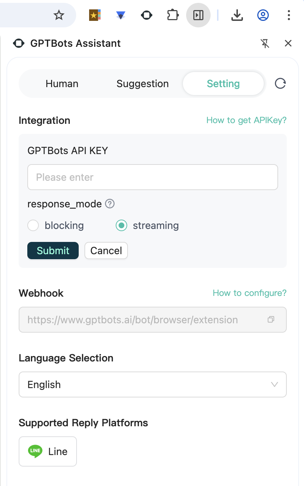

# gptbots-chrome-extension
English | [中文](./README-zh.md)

An AI customer service assistant based on browser extension technology.
Based on the LINE WEB backend, it provides features such as automatic replies to user messages and notifications for manual service requests. Support for more platforms like Telegram and WhatsApp will be gradually introduced in the future.



## Setup
Rsbuild project

Install the dependencies:

```bash
pnpm install
```

## Get started

Start the dev server:

```bash
pnpm dev
```

Build the app for production:

```bash
pnpm build
```

Preview the production build locally:

```bash
pnpm preview
```

## Development
1. First, import the extension into your browser by loading the chrome folder directly
2. Configure the GPTBots API KEY in the extension settings, using the integration API for the corresponding environment (you can use staging or production integration API)
3. Build the project: `pnpm run build:prod`
4. Open the extension to view the corresponding page on the official account

## Extension Packaging
After executing the build command:

In a `bash` environment, run `npm run zip:chrome` in terminal to create a `zip` file, generating something like: `gptbots-assistant-06171839.zip` for testing
> Or manually compress the `chrome` folder into a `zip` file

- Development packaging
```
npm run build:dev
```

- Production environment packaging
```
npm run build:prod
```
## Extension Storage
Uses `chrome.storage.local` for data storage


## content-script
- Switch reply user
> chrome/content-scripts/line/user-reply.js
```js
/**
 * Switch chat
 * @param {string} name
 */
function handleSwitchChat(name) {
  const userList = document.querySelectorAll('.list-group-item-chat>a');
  if (userList) {
    const item = Array.from(userList).find((i) => {
      const el = i.querySelector('h6.text-truncate-box');
      return el && el.innerText === name;
    });
    if (item) {
      item.click();
      setTimeout(() => handleInit(), 100);
    }
  }
}
```

- Get chat reply content
> chrome/content-scripts/line/user-reply.js
```js
/** Handle user reply */
function handleUserReply() {
  const messageEls = Array.from(document.querySelectorAll('.chat'));
  if (messageEls.length) {
    // Find the index of the last response message
    const lastIndex = messageEls.findLastIndex((el) => el.classList.contains('chat-reverse'));
    // Get user reply
    const data = (lastIndex !== -1 ? messageEls.slice(lastIndex + 1) : messageEls).map((el) =>
      Array.from(el.querySelectorAll('.chat-item-text'))
        .map((item) => item.textContent)
        .join(' '),
    );
    // Send message to extension
    data.length && chrome.runtime.sendMessage({ type: 'UserReply', data });
  }
}
```

## Feature Description
`SSE` uses the `npm` package [fetch-event-source](https://www.npmjs.com/package/@microsoft/fetch-event-source)

### Human Customer Service
`SSE` requests
- In the chat interface of the corresponding website, click to switch chats
- Copy username for manual search

### Reply Suggestions
`SSE` requests
- Content script
  - The extension injects JavaScript into websites
    - Configure `content-script` in `manifest.json` by specifying domains and injected scripts
    - Avoid affecting already supported websites, such as `chrome/content-script/line/` folder adapted for `LINE`
  - Listen for user reply content using `DOM` node changes with `MutationObserver`
  - Extension handles data sending via `chrome.runtime.onMessage`
- After AI generates suggestions, choose usage method
  - Put content into chat interface input box for modification
  - Put content into chat interface input box and send directly

### Settings
  - Set `api_key`, saved using AES encryption/decryption
  - Set `Reply Suggestions` response_mode: `Streaming` or `Blocking`
  - Switch language, supports: `English`/`Simplified Chinese`/`Traditional Chinese`/`Japanese`/`Spanish`/`Thai`
  - Currently supported platforms

